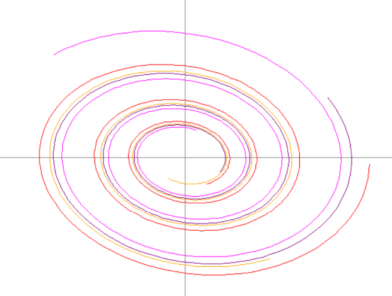
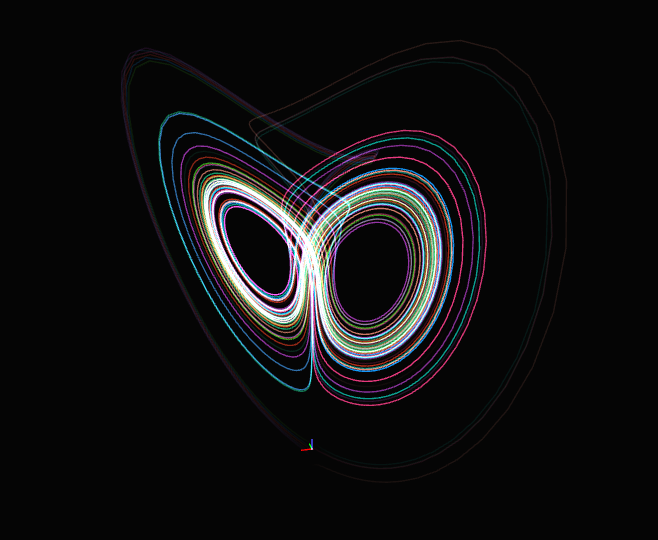

# Differential Equations Library (diffeq-lib)

A Python library for solving, analyzing, and visualizing differential equations without external dependencies. Developed for KBTU Python II final project.

## Features

- **Numerical Integration**: Euler, Runge-Kutta 4th order methods
- **Symbolic Computation**: Automatic differentiation, Jacobian, divergence
- **Vector Operations**: Custom vector class with mathematical operations
- **Visualization**: Phase portraits, trajectories, vector fields using Turtle
- **Numerical Calculus**: Numerical Jacobian and divergence computation

## Building from Source
If you want to use this as a library instead of copying the entire repository for each project:
```bash
#installing build tools
pip install build wheel

#building the distribution
python -m build --wheel

#the wheel file will be created in dist/diffeq_lib-0.1.0-py3-none-any.whl
```
<!--SLIDE_END-->

## Installation

### From Wheel File
```bash
pip install dist/diffeq_lib-0.1.0-py3-none-any.whl
```

### From Source
```bash
#cloning the repository
git clone https://github.com/Squmon/KBTU-python-2-final.git
cd KBTU-python-2-final

#installing the package 
pip install .
```

### Verify Installation
```bash
python -c "from diffeq import *; print('success')"
```
<!--SLIDE_END-->
## Project Structure

```bash
KBTU-python-2-final/
├── diffeq/                     # Main library
│   ├── __init__.py
│   ├── SDE.py                  # Systems and integrators
│   ├── plotting/               # Visualization
│   │   ├── __init__.py
│   │   ├── drawing_utils.py
│   │   └── visualization_tasks.py
│   └── utils/                  # Utilities
│       ├── __init__.py
│       ├── calculus.py         # Numerical methods (Jacobian, divergence)
│       ├── string_operations.py
│       ├── symbolic.py         # Symbolic computations
│       └── vectors.py          # Vector operations
├── tests/                      # Tests
│   └── test_numerical_methods.py
├── .gitignore                  # Git ignore files
├── pyproject.toml              # Build configuration
├── README.md                   # Documentation
├── setup.py                    # Installation configuration
└── tasks.md                    # Tasks
```
<!--SLIDE_END-->
# Nurzhan's part
## Numerical Jacobian & Divergence/Library Packaging

## What I Implemented

- jacobian(F, x: vector, h=None) - Computes numerical Jacobian matrix for vector functions

- divergence(F, x: vector, h=None) - Computes numerical divergence of vector fields

- Library packaging system - setup.py and pyproject.toml for distribution

## Key Features

- Adaptive step sizing - Automatically selects optimal h based on input scale
- Central difference method - O(h²) accuracy using [F(x+h) - F(x-h)]/(2h)
- Error protection - Handles edge cases and validates dimensions
- Full project integration - Works with custom vector class and vector_function decorator
- Production-ready packaging - Complete build system for .whl distribution
<!--SLIDE_END-->
## Example Usage
```python
from diffeq.utils.calculus import jacobian, divergence
from diffeq.utils.vectors import vector

# Define vector field
def field(state):
    return vector({'x': state['x']**2, 'y': state['y']**2})

# Analyze at point
point = vector({'x': 2.0, 'y': 3.0})
J = jacobian(field, point)      # Jacobian matrix
div = divergence(field, point)  # Divergence scalar

print(f"∂Fₓ/∂x = {J['dx_dx']:.4f}")  # 4.0
print(f"Divergence = {div:.4f}")     # 10.0
```

## Build & Install
```bash

# Build package
python -m build --wheel

# Install locally
pip install dist/diffeq_lib-0.1.0-py3-none-any.whl

# Verify installation
python -c "from diffeq.utils.calculus import jacobian; print('Installed!')"
```
<!--SLIDE_END-->
## Applications

- Stability analysis of differential equations
- Flow field analysis - identify sources/sinks via divergence
- Educational tool - compare numerical vs analytical methods
- Research - analyze chaotic systems like Lorenz attractor

### My implementation provides accurate, robust numerical differentiation that integrates seamlessly with the project's existing vector-based architecture.
<!--SLIDE_END-->


# Dasha's part

## VISUALIZATION PART: 

This part of the library uses the Turtle module to turn math into pictures. We built it so you can see phase portraits and vector fields without needing to install big libraries like Matplotlib.

### What it does:

Auto-Scaling: You don't have to worry about pixels. Just give it math coordinates (like -5 to 5), and it fits them to the window automatically.

Vector Fields: Draws those blue arrows that show where the system is "flowing.

"Multi-color Lines: If you plot several trajectories, it gives each one a different color so they don't get mixed up.

Fast Mode: Uses tracer(0,0) so the drawing happens almost instantly instead of watching the turtle walk around.
<!--SLIDE_END-->
## Drawing trajectories 
1. If you already have a list of $(x, y)$ points, you can just throw them into draw_phase_portrait() function
```python
from diffeq.plotting.visualization_tasks import draw_phase_portrait, generate_spiral_trajectories
data = generate_spiral_trajectories()
draw_phase_portrait(data, x_range=(-5, 5), y_range=(-5, 5))

```
2. The full phase portrait (Arrows + Lines)
When you give a fuction some initial points and system function it displays everything on a phase portrait.
``` python
from diffeq.plotting.visualization_tasks import plot_phase_portrait

#defining a system
def my_system(x, y):
    return {'x': y, 'y': -x - 0.5 * y}

#picking starting points
starts = [{'x': 2, 'y': 0}, {'x': 0, 'y': 2}]

#plotting
plot_phase_portrait(my_system, initial_points=starts, x_range=(-4, 4), y_range=(-4, 4))
```
<!--SLIDE_END-->
## Main functions:

1. plot_phase_portrait: The big one. Draws the vector field (blue arrows) and then runs the solver to draw trajectories (colored lines).

2. setup_canvas: Sets up the window, draws the X and Y axes, and handles the scaling logic.

3. save_turtle_image: Saves your masterpiece as a .eps file (handy for reports).

 ## EXAMPLE 

 In this example we modeled a damped oscillator. You can see the trajectories spiraling inward-this is a classic sink in differential equations. Our library handles the numerical integration and then uses the Turtle module to draw these paths.
 
 ### Initial input:
 ```python
 for x0, y0 in [(4,0), (3,2), (2,-3), (-3,3)]:
```
 We input a mathematical rule (differential equations) that describes how the system changes over time:
 ```python
 dx = y
dy = -x - 0.2*y  
```
<!--SLIDE_END-->
### OUTPUT:



## CONCLUSION:

This visualisation module turns numbers into clear pictures.
<!--SLIDE_END-->
# Ilya's part
### symbolic
implements operations with symbols
```python
from diffeq.utils.symbolic import *
x, y = variable('x'), variable('y')
expression = x**2 + y*x + cos(x) + 3

print(expression)
print('without optimizations:')
print(expression.diff('x'))
print(expression.diff('y'))
print('with optimizations:')
print(expression.diff('x').optim())
print(expression.diff('y').optim())
print('second derivative:')
print(expression.diff('x').diff('x').optim())
print('packaging into "programs"')
prog = program({'output':expression})
prog(x = 1, y = 2)
print('execution order:')
print(prog)
```
<!--SLIDE_END-->
Output:
```
((x^2)+y*x+cos(x)+3)
without optimizations:
(2*(x^1)*1.0+(0.0*x+y*1.0)+(-sin(x))*1.0+0.0)
(2*(x^1)*0.0+(1.0*x+y*0.0)+(-sin(x))*0.0+0.0)
with optimizations:
(x*2+y+sin(x)*-1)
x
second derivative:
((1^2)*(x^0)*2+cos(x)*-1)
packaging into "programs"
execution order:
x,y,3
(x^2),y*x,cos(x)
((x^2)+y*x+cos(x)+3)
```
<!--SLIDE_END-->
### vectors
```python
# inherits from dict
class vector(dict):...
```

Keys - axis names  
Values - projection values of the vector on the corresponding axis  

When adding/scalar multiplying/element-wise operations, corresponding keys will be added, and in case of mismatched keys, it will be assumed that missing keys have a value of zero.
Example:
``` python
from diffeq.utils.vectors import *
A = vector(x = 10, y = 10)      
B = vector(x = 3, y = -1, z = 1)
```
<!--SLIDE_END-->
#### Showing vectors
```python
>>> print('A:', A, sep = '\n'*2)
A:

┌─────────────┐
│axis │value  │
├─────┼───────┤
│x    │10     │
│y    │10     │
└─────────────┘

>>> print('B:', B, sep = '\n'*2)        
B:

┌─────────────┐
│axis │value  │
├─────┼───────┤
│x    │3      │
│y    │-1     │
│z    │1      │
└─────────────┘
```
<!--SLIDE_END-->
#### Addition/substraction
```python
>>> print('A + B:', A + B, sep = '\n'*2)
A + B:
┌──────────────┐
│axis │value   │
├─────┼────────┤
│x    │13      │
│z    │1.0     │
│y    │9       │
└──────────────┘
>>> print('A - B:', A - B, sep = '\n'*2)
A - B:

┌───────────────┐
│axis │value    │
├─────┼─────────┤
│x    │7        │
│z    │-1.0     │
│y    │11       │
└───────────────┘
```
<!--SLIDE_END-->
#### Dot/Adamar products
```python
>>> print('A @ B:', A @ B, sep = '\n'*2)
A @ B:

20
>>> print('A * B:', A * B, sep = '\n'*2)
A * B:

┌──────────────┐
│axis │value   │
├─────┼────────┤
│x    │30      │
│z    │0.0     │
│y    │-10     │
└──────────────┘
```
<!--SLIDE_END-->
#### Division and power
```python
>>> print('A / B:', A / B, sep = '\n'*2)
A / B:

┌─────────────────────────────┐
│axis │value                  │
├─────┼───────────────────────┤
│x    │3.3333333333333335     │
│z    │0.0                    │
│y    │-10.0                  │
└─────────────────────────────┘
>>> print('A ** B:', A ** B, sep = '\n'*2)
A ** B:

┌───────────────┐
│axis │value    │
├─────┼─────────┤
│x    │1000     │
│z    │0.0      │
│y    │0.1      │
└───────────────┘
```
<!--SLIDE_END-->
#### Scalar powers
```python
>>> print('A**2:', A**2, sep = '\n'*2)
A**2:

┌──────────────┐
│axis │value   │
├─────┼────────┤
│x    │100     │
│y    │100     │
└──────────────┘
>>> print('2**A:', 2**A, sep = '\n'*2)
2**A:

┌───────────────┐
│axis │value    │
├─────┼─────────┤
│x    │1024     │
│y    │1024     │
└───────────────┘
>>> print('A@A:', A@A)
A@A: 200
```
<!--SLIDE_END-->
#### Vector functions
Implements methods for working with vector functions. Inherits from `program` in symbolic.
```python
@vector_function
def foo(x, y):
    return vector(
        x=10*y*x + y,
        y=x,
    )

v = vector(x = 10, y = 11)
print('value of input vector: ', v, sep = '\n')
print('function form: ', sep = '\n')
print(foo)
print('function output: ', sep = '\n')
print(foo(v))
print("function's Jacobian: ", sep = '\n')
print(foo.yacobian)
print("function's Jacobian value: ", sep = '\n')
print(foo.yacobian(v))
```
Output:
```
value of input vector: 
┌─────────────┐
│axis │value  │
├─────┼───────┤
│x    │10     │
│y    │11     │
└─────────────┘
```
<!--SLIDE_END-->
```
function form: 
┌────────────────────────┐
│axis │function          │
├─────┼──────────────────┤
│x    │(y*x*10+y)        │
│y    │x                 │
└────────────────────────┘
function output: 
┌───────────────┐
│axis │value    │
├─────┼─────────┤
│x    │1111     │
│y    │10       │
└───────────────┘
function's Jacobian: 
┌────────────────────────────┐
│axis     │function          │
├─────────┼──────────────────┤
│dx_dx    │(y*10)            │
│dx_dy    │(x*10+1.0)        │
│dy_dx    │1.0               │
│dy_dy    │0.0               │
└────────────────────────────┘
function's Jacobian value: 
┌────────────────────┐
│axis     │value     │
├─────────┼──────────┤
│dx_dx    │110       │
│dx_dy    │101.0     │
│dy_dx    │1.0       │
│dy_dy    │0.0       │
└────────────────────┘
```
<!--SLIDE_END-->

Composition:
```python
from diffeq.utils.vectors import *
@vector_function
def foo1(x, y):
    return vector(
        x=10*y*x + y,
        y=-x + (-1),
    )

@vector_function
def foo2(x, y):
    return vector(
        x = 3*y - x,
        y = x - 1j
    )

@vector_function
def composed(x, y):
    return foo2(foo1(vector(x = x, y = y)))

A = vector(x = 1, y = 2)
```
<!--SLIDE_END-->
```python
>>> print(composed)
┌─────────────────────────────────────────┐
│axis │function                           │
├─────┼───────────────────────────────────┤
│x    │(((-x)+-1)*3+(-(y*x*10+y)))        │
│y    │(y*x*10+y+-1j)                     │
└─────────────────────────────────────────┘
>>> print(composed.yacobian)
┌───────────────────────────────────┐
│axis     │function                 │
├─────────┼─────────────────────────┤
│dx_dy    │((-(x*10+1.0))+3)        │
│dx_dx    │((-y*10)+-3.0)           │
│dy_dy    │(x*10+1.0)               │
│dy_dx    │(y*10)                   │
└───────────────────────────────────┘
>>> print(composed.div)
┌───────────────────────────────────┐
│axis   │function                   │
├───────┼───────────────────────────┤
│div    │(x*10+(-y*10)+-2.0)        │
└───────────────────────────────────┘
>>> print(composed.div.yacobian)
┌───────────────────────┐
│axis       │function   │
├───────────┼───────────┤
│ddiv_dy    │-10        │
│ddiv_dx    │10         │
└───────────────────────┘
```
<!--SLIDE_END-->
## Plotting

interactive.py
provides the ability to generate an interactive HTML containing one or more trajectories.  
It allows setting the color and display style.
```python
def generate_html(trajectores:list[vector], axes:tuple[str], path = 'output.html', color:callable = __basic_grad, title:str = ''):...
```

### Example

```python
from random import gauss, random
import diffeq.plotting.interactive as interactive
from diffeq import *

# Lorenz Attractor
a, b, c = -15, 35, -3/2
solver = rk4_integrator(0.01, 1)
lorenz_sys = system(
    vector_function(lambda x, y, z:vector(x = a*(x - y), y = b*x - y - z*x, z = x*y + c*z)), solver
    )

# calculating trajectories
lorenz_trjs = []
for _ in range(10):
    lorenz_sys.state = vector(x = gauss(), y = gauss(), z = gauss())
    results = lorenz_sys.run(10)
    lorenz_trjs.append(results)

# saving
out = interactive.generate_html(lorenz_trjs, ('x', 'y', 'z'), color = interactive.start_end_grad(), title = 'Lorenz Attractor', path = 'output/lorenz.html')
```
<!--SLIDE_END-->
[Output:](output/lorenz.html)




<!--SLIDE_END-->
display styles look like this (but the difference is usually not noticeable for long trajectories):
```python
# fading tail
def basic_grad(color = None, transparent_coof = 1.0):
    Col = color
    bias = randint(0, 100)
    def f(t, i, **kwrgs):
        if Col is None:
            color = random_color(i)
        else:
            color = Col
        return color + [t*transparent_coof]
    return f

# fading tail and head
def start_end_grad(color = None, transparent_coof = 1.0):
    Col = color
    bias = randint(0, 100)
    def f(t, i, **kwrgs):
        if Col is None:
            color = random_color(i + bias)
        else:
            color = Col
        return color + [4*t*(1 - t)*transparent_coof]
    return f
```
<!--SLIDE_END-->
## diffeq

### integrators
abstract class for numerical integration:
```python 
class integrator: ...
```
Implemented integrators:
```python 
class euler_integrator(integrator): ...
class rk4_integrator(integrator):...
```
By default, integrators when called 
```python
solver.integrate(x, dx)
```
will perform `int(1/dt)` per call.
<!--SLIDE_END-->
### system
system is responsible for the integration pipeline
```python
class system:
    def __init__(self, ds_dt: _ve.vector_function, solver, initials: _ve.vector = None):...
```
### Example
```python
from diffeq.utils.vectors import vector, vector_function
from diffeq import system, rk4_integrator

@vector_function
def vector_field(x, y):
    return vector({
        'x': x**2 - y,      # x-component
        'y': x - y**2       # y-component
    })

solver = rk4_integrator(0.01)
sys = system(vector_field, solver, initials=vector(x=1, y=2))
results = sys.run(5)

>>> print(results)
┌────────────────────────────────────────────────────────────────────────────────────────────────────┐
│axis    │value                                                                                      │
├────────┼───────────────────────────────────────────────────────────────────────────────────────────┤
│x       │[1, -0.6894983901924571, -1.3577716526112518, -1.410813685844128, -1.4140123825971138]     │
│y       │[2, 2.0, 2.0, 2.0, 2.0]                                                                    │
│time    │[0, 1.0, 2.0, 3.0, 4.0]                                                                    │
└────────────────────────────────────────────────────────────────────────────────────────────────────┘
```