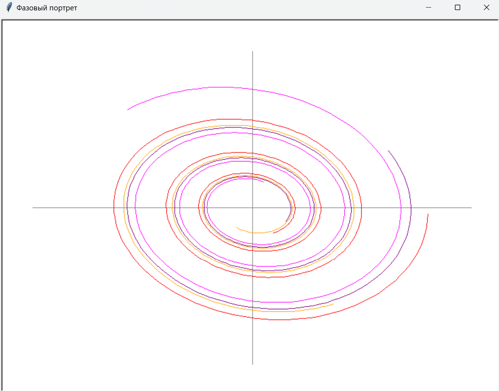

## VISUALIZATION PART: 

This part of the library uses the Turtle module to turn math into pictures. We built it so you can see phase portraits and vector fields without needing to install big libraries like Matplotlib.

### What it does:

Auto-Scaling: You don't have to worry about pixels. Just give it math coordinates (like -5 to 5), and it fits them to the window automatically.

Vector Fields: Draws those blue arrows that show where the system is "flowing.

"Multi-color Lines: If you plot several trajectories, it gives each one a different color so they don't get mixed up.

Fast Mode: Uses tracer(0,0) so the drawing happens almost instantly instead of watching the turtle walk around.

### Drawing trajectories 
1. If you already have a list of $(x, y)$ points, you can just throw them into draw_phase_portrait() function
```python

from diffeq.plotting.visualization_tasks import draw_phase_portrait, generate_spiral_trajectories
data = generate_spiral_trajectories()
draw_phase_portrait(data, x_range=(-5, 5), y_range=(-5, 5))

```
2. The full phase portrait (Arrows + Lines)
When you give a fuction some initial points and system function it displays everything on a phase portrait.
``` python

from diffeq.plotting.visualization_tasks import plot_phase_portrait

#defining a system
def my_system(x, y):
    return {'x': y, 'y': -x - 0.5 * y}

#picking starting points
starts = [{'x': 2, 'y': 0}, {'x': 0, 'y': 2}]

#plotting
plot_phase_portrait(my_system, initial_points=starts, x_range=(-4, 4), y_range=(-4, 4))
```
## Main functions:

1. plot_phase_portrait: The big one. Draws the vector field (blue arrows) and then runs the solver to draw trajectories (colored lines).

2. setup_canvas: Sets up the window, draws the X and Y axes, and handles the scaling logic.

3. save_turtle_image: Saves your masterpiece as a .eps file (handy for reports).


 ## EXAMPLE 

 In this example we modeled a damped oscillator. You can see the trajectories spiraling inward-this is a classic sink in differential equations. Our library handles the numerical integration and then uses the Turtle module to draw these paths.
 
 ### Initial input:
 ```python
 for x0, y0 in [(4,0), (3,2), (2,-3), (-3,3)]:
```
 We input a mathematical rule (differential equations) that describes how the system changes over time:
 ```python
 dx = y
dy = -x - 0.2*y  
```
### OUTPUT:



## CONCLUSION:

This visualisation module turns numbers into clear pictures.